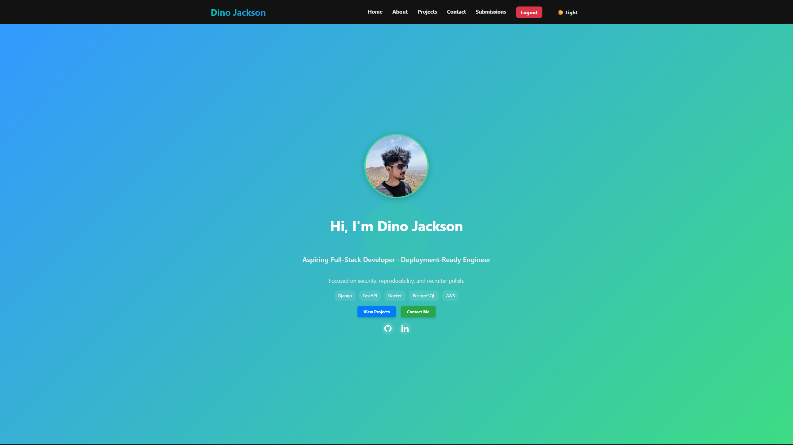
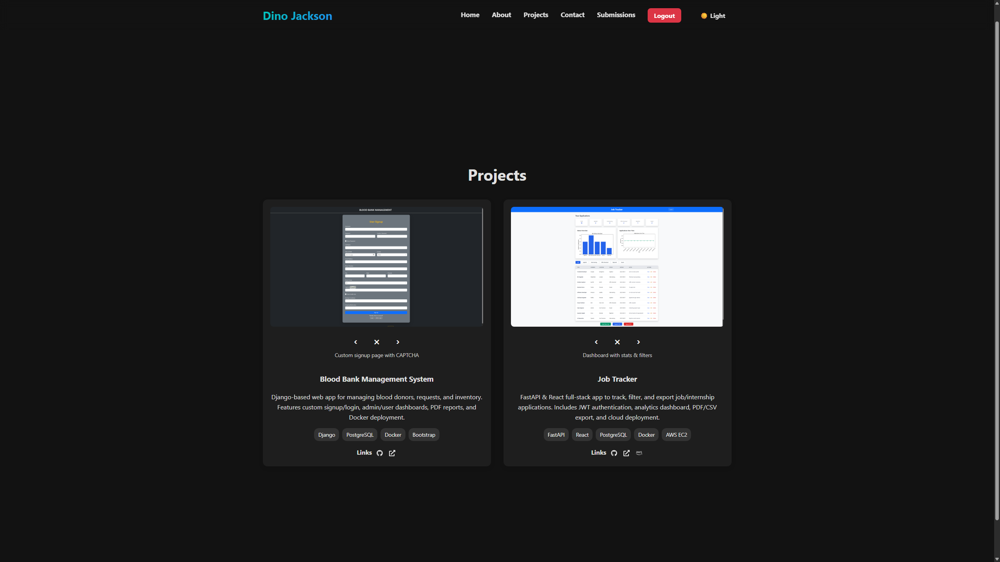
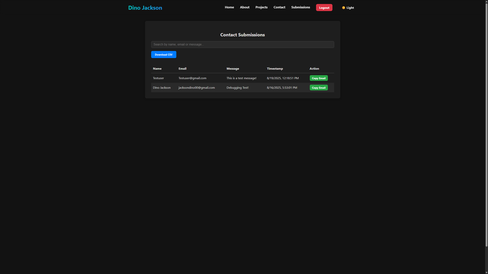

# 🚀 Portfolio App

[](https://github.com/Dno-J/portfolio-app) 
[](http://16.171.148.202) 
[](https://www.linkedin.com/in/dino-jackson-486840368/) 
[](https://github.com/Dno-J/portfolio-app/commits/main) 
 


A full-stack personal portfolio application showcasing my projects, skills, and deployment architecture. Built with FastAPI, React, Docker, and deployed on EC2 with Nginx reverse proxy.

---

## 🛠 Tech Stack

| Layer            | Technologies |
|------------------|--------------|
| **Frontend**     |   |
| **Backend**      |   |
| **Database**     |  |
| **Authentication** |  |
| **Deployment**   |     |
| **Version Control** |   |

---

## 📦 Features

* ⚙️ **Modular multi-container setup with Docker** — backend (FastAPI) + frontend (React) + Nginx proxy.
* 🔐 **JWT-based authentication** — secure login flow for submissions dashboard.
* 🌐 **CORS-safe API proxying via Nginx** — clean separation of frontend/backend traffic.
* 📄 **SPA routing support** — React Router with client-side navigation.
* 🧪 **Reproducible builds & environment-driven config** — `.env` and `.env.example` for portability.
* 📬 **Submissions Dashboard** — view and manage messages from the contact form.
* 📊 **Export submissions as CSV** — easily download and analyze received messages.
* 📑 **Integrated Resume Viewer & Download** — PDF resume embedded in the app.
* 🖼 **Project Showcase** — interactive cards with screenshots, tech stack, and live links.
* 🎨 **Light/Dark Mode support** — global theming with React Context API.
* 🔧 **CI-ready structure** — backend and frontend separated with Docker + Nginx config for smooth deployment.

---

## 🚀 Getting Started

### 1. Clone the repo

```bash
git clone https://github.com/Dno-J/portfolio-app.git
cd portfolio-app
```

### 2. Set up environment variables

All required environment variables are listed in `.env.example`.

To get started:
```bash
cp .env.example .env
```

### 3. Build and run containers

```bash
docker-compose up --build
```

App will be available at `http://localhost:8001` or your EC2 IP.

---

## 📄 API Documentation

FastAPI auto-generates interactive docs at:

http://16.171.148.202:8001/docs

## 🎥 Demo

**Landing Page**  
A clean, responsive hero section introducing me and my portfolio.  


**Projects Page**  
Showcases my deployed projects (Job Tracker, BBMS, etc.) with live links and details.  


**Submissions Dashboard**  
Interactive dashboard for managing portfolio form submissions (e.g., contact requests).  


🔗 [Live App on AWS EC2](http://16.171.148.202)


## 🔧 File Structure

```
portfolio-app/
├── backend/
│   ├── Dockerfile               # Backend container setup
│   ├── requirements.txt         # Python dependencies
│   └── app/
│       ├── main.py              # FastAPI app entrypoint
│       ├── api.py               # API route definitions
│       ├── auth.py              # JWT auth logic
│       ├── contact.py           # Contact form handling
│       ├── database.py          # DB connection setup
│       ├── models.py            # Pydantic models / ORM schemas
│       └── settings.py          # Env config loader via os.getenv()
│
├── frontend/
│   ├── Dockerfile               # Frontend container setup
│   ├── nginx.conf               # Nginx reverse proxy config
│   ├── public/
│   │   └── index.html           # HTML entrypoint for React
│   └── src/
│       ├── App.js               # Root React component
│       ├── index.js             # React DOM renderer
│       ├── theme.js             # Theme config (light/dark)
│       ├── components/
│       │   ├── layout/Navbar.jsx        # Top navigation bar
│       │   ├── sections/Hero.jsx        # Hero section of landing page
│       │   ├── sections/About.jsx       # About section
│       │   └── ui/ProjectCard.jsx       # Project display card
│       ├── pages/
│       │   ├── Landing/Landing.jsx      # Main landing page
│       │   ├── Projects/Projects.jsx    # Project showcase page
│       │   └── Login/LoginForm.jsx      # Login form component
│       └── context/ThemeContext.jsx     # Global theme context
```

---

## 📡 Deployment Notes

- EC2 instance with open ports `80`, `443`, and `8001`
- Nginx reverse proxy handles static assets and API routing
- PostgreSQL hosted on Neon.tech with SSL and channel binding
- Safe container orchestration with isolated networks

---

## 👨‍💻 Author

**Dino Jackson**  
_Aspiring full-stack developer & deployment architect_  
[](https://www.linkedin.com/in/dino-jackson-486840368)
[](https://github.com/Dno-J)
[](mailto:jacksodino00@gmail.com)


---

## License

This project is licensed under the [MIT License](LICENSE).

```
MIT License

Copyright (c) 2025 Dino Jackson

Permission is hereby granted, free of charge, to any person obtaining a copy
of this software and associated documentation files (the "Software"), to deal
in the Software without restriction, including without limitation the rights
to use, copy, modify, merge, publish, distribute, sublicense, and/or sell
copies of the Software, and to permit persons to whom the Software is
furnished to do so, subject to the following conditions:

The above copyright notice and this permission notice shall be included in all
copies or substantial portions of the Software.

THE SOFTWARE IS PROVIDED "AS IS", WITHOUT WARRANTY OF ANY KIND, EXPRESS OR
IMPLIED, INCLUDING BUT NOT LIMITED TO THE WARRANTIES OF MERCHANTABILITY,
FITNESS FOR A PARTICULAR PURPOSE AND NONINFRINGEMENT. IN NO EVENT SHALL THE
AUTHORS OR COPYRIGHT HOLDERS BE LIABLE FOR ANY CLAIM, DAMAGES OR OTHER
LIABILITY, WHETHER IN AN ACTION OF CONTRACT, TORT OR OTHERWISE, ARISING FROM,
OUT OF OR IN CONNECTION WITH THE SOFTWARE OR THE USE OR OTHER DEALINGS IN THE
SOFTWARE.
```
<p align="center">
  Built with ❤️ by <strong>Dino Jackson</strong>
</p>

