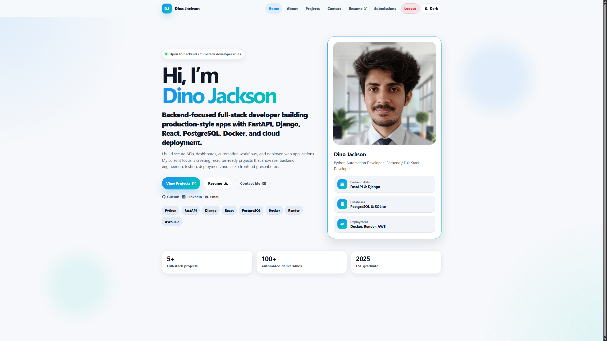
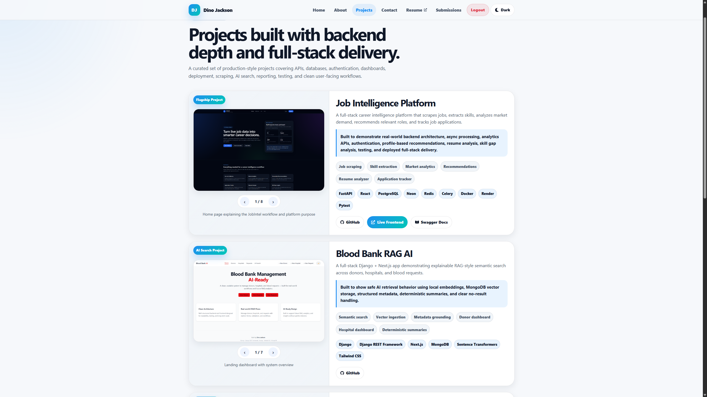
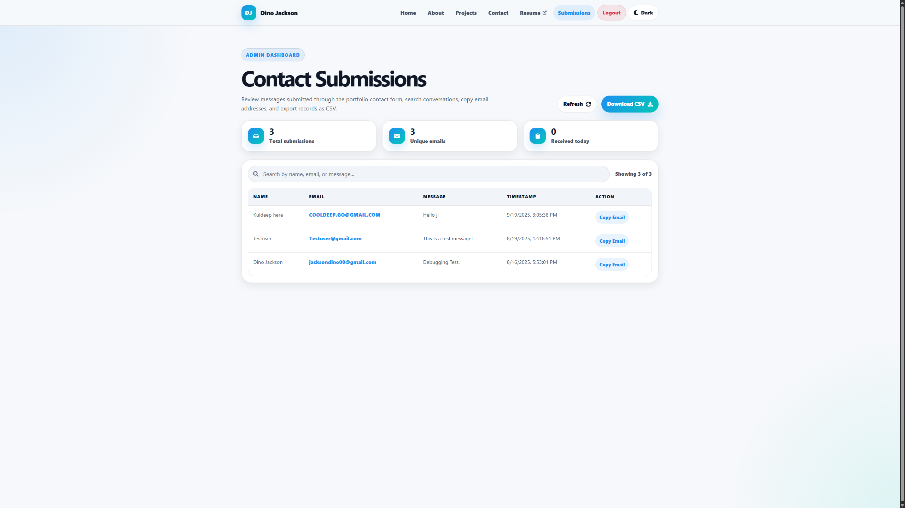

# Portfolio App

> A full-stack developer portfolio built to showcase projects, skills, deployment experience, and contact submissions through a professional React + FastAPI application.

Portfolio App is a full-stack personal portfolio application built with **React, FastAPI, PostgreSQL, Docker, Nginx, JWT authentication, and Render deployment**.

The app presents my developer profile, selected projects, resume, contact form, and an admin-only submissions dashboard. It is designed to serve as a recruiter-ready portfolio while also demonstrating backend integration, authentication, deployment configuration, and clean frontend presentation.

---

## Live Links

- **Live Portfolio:** https://portfolio-frontend-wy8a.onrender.com/
- **GitHub Repository:** https://github.com/Dno-J/portfolio-app
- **LinkedIn:** https://www.linkedin.com/in/dino-jackson-486840368/

> This project was originally deployed on AWS EC2 using Docker and Nginx. The current active deployment is hosted on Render.

---

## Table of Contents

- [Motivation](#motivation)
- [Project Overview](#project-overview)
- [Core Features](#core-features)
- [Architecture](#architecture)
- [System Workflow](#system-workflow)
- [Tech Stack](#tech-stack)
- [Key Files and Responsibilities](#key-files-and-responsibilities)
- [Screenshots](#screenshots)
- [Local Development Setup](#local-development-setup)
- [Environment Variables](#environment-variables)
- [API Overview](#api-overview)
- [Deployment Notes](#deployment-notes)
- [Security Notes](#security-notes)
- [Limitations](#limitations)
- [Future Improvements](#future-improvements)
- [Why This Project Matters](#why-this-project-matters)
- [Author](#author)
- [License](#license)

---

## Motivation

A developer portfolio should do more than list projects.

It should clearly communicate:

- what kind of developer I am,
- what technologies I work with,
- which projects best represent my skills,
- how those projects were built and deployed,
- and how recruiters or collaborators can contact me.

This portfolio was built to present my work professionally while also functioning as a real full-stack application with a backend, database, authentication, contact form, protected admin dashboard, CSV export, and deployment workflow.

---

## Project Overview

The Portfolio App includes:

- a professional landing page,
- an about page with experience, skills, education, publication, and career focus,
- a selected projects page with screenshots and lightbox previews,
- a contact page connected to a FastAPI backend,
- an admin-only login page,
- a protected submissions dashboard,
- CSV export for contact submissions,
- dark/light mode,
- and Docker-based local development.

The portfolio currently highlights projects such as:

- Job Intelligence Platform,
- Blood Bank RAG AI,
- Job Tracker,
- Blood Bank Management System,
- and this Portfolio App itself.

---

## Core Features

### 1. Professional Landing Page

The landing page introduces my profile as a backend-focused full-stack developer.

It includes:

- developer positioning,
- key technologies,
- project CTA,
- resume link,
- contact CTA,
- GitHub and LinkedIn links,
- and summary cards for backend, database, and deployment experience.

---

### 2. About Page

The about page presents:

- professional experience,
- education,
- current focus,
- backend skills,
- database skills,
- frontend skills,
- deployment tools,
- publication link,
- and project approach.

It is designed to be easier to scan than a resume while still giving recruiters useful context.

---

### 3. Projects Showcase

The projects page displays selected work with:

- project title,
- project badge,
- description,
- technical impact,
- feature tags,
- tech stack badges,
- GitHub/live/docs links,
- screenshots,
- carousel controls,
- and lightbox image previews.

Featured projects include:

- Job Intelligence Platform,
- Blood Bank RAG AI,
- Job Tracker,
- Blood Bank Management System,
- and Portfolio App.

---

### 4. Screenshot Lightbox

Project screenshots can be opened in a full-screen lightbox.

The lightbox supports:

- previous/next navigation,
- keyboard navigation,
- Escape key close,
- clickable progress dots,
- captions,
- and responsive layout.

---

### 5. Contact Form

Visitors can send messages through the contact form.

The form includes:

- name field,
- email field,
- message field,
- validation,
- success/error states,
- backend API submission,
- and direct links to email, GitHub, and LinkedIn.

---

### 6. Admin Login

The app includes a protected admin login for viewing contact submissions.

Authentication uses:

- admin credentials from environment variables,
- JWT access token generation,
- protected API routes,
- and frontend route protection.

---

### 7. Submissions Dashboard

The protected dashboard allows the admin to:

- view submitted contact messages,
- search submissions,
- copy email addresses,
- view submission stats,
- refresh data,
- and export submissions as CSV.

---

### 8. Dark/Light Mode

The UI supports dark and light mode using React context, CSS variables, and persisted local storage preference.

---

### 9. Dockerized Local Development

The app supports local development with Docker Compose, including:

- React frontend container,
- FastAPI backend container,
- PostgreSQL database container,
- shared Docker network,
- and environment-based configuration.

---

## Architecture

```txt
Visitor / Admin
      |
      v
React Frontend
      |
      v
FastAPI Backend
      |
      v
SQLModel ORM
      |
      v
PostgreSQL Database
````

### Local Docker Architecture

```txt
Browser
  |
  v
React + Nginx Container
  |
  v
FastAPI Backend Container
  |
  v
PostgreSQL Container
```

### Deployment Architecture

```txt
Render Static Frontend
        |
        v
Render FastAPI Backend
        |
        v
Managed PostgreSQL / Neon Database
```

---

## System Workflow

1. A visitor opens the portfolio frontend.
2. React Router handles public pages such as Home, About, Projects, and Contact.
3. Project cards display screenshots, links, tech stacks, and project summaries.
4. The contact form sends a POST request to the FastAPI backend.
5. FastAPI validates the request and stores the submission in PostgreSQL.
6. Admin logs in through the login page.
7. Backend validates admin credentials and returns a JWT token.
8. Protected frontend routes use the token to access submissions.
9. Admin can search submissions, copy email addresses, refresh records, and export CSV.
10. Render hosts the current public deployment.

---

## Tech Stack

### Frontend

* React
* React Router
* CSS Modules
* CSS variables
* React Icons
* Nginx for static serving in Docker

### Backend

* FastAPI
* SQLModel
* Pydantic
* Python
* JWT authentication
* OAuth2 password form flow

### Database

* PostgreSQL
* SQLModel ORM
* Local Docker PostgreSQL for development
* Managed PostgreSQL / Neon for deployment

### Authentication

* JWT access tokens
* Admin credentials from environment variables
* Protected backend routes
* Protected frontend route wrapper

### Deployment

* Docker
* Docker Compose
* Render
* Nginx
* Previous AWS EC2 deployment experience

### Tools

* Git
* GitHub
* PowerShell
* Postman / Swagger UI for API testing

---

## Key Files and Responsibilities

### Frontend — `frontend/src`

* `App.js`
  Main React router, route definitions, protected route usage, login state handling, and layout setup.

* `index.css`
  Global CSS variables, light/dark theme tokens, base styles, and shared defaults.

* `App.css`
  Shared page-level styles for Projects, About, Admin Login, and Submissions Dashboard.

* `context/ThemeContext.jsx`
  Manages dark/light mode and persists theme preference in local storage.

* `components/layout/Navbar.jsx`
  Main navigation bar with active links, resume link, theme toggle, and authenticated admin actions.

* `components/layout/Navbar.module.css`
  Scoped navbar styles and responsive mobile navigation.

* `components/sections/Hero.jsx`
  Landing page hero section with profile summary, CTA buttons, social links, and technical highlights.

* `components/sections/About.jsx`
  About page content including experience, education, skills, publication, and development focus.

* `pages/Projects/Projects.jsx`
  Project data and selected project showcase.

* `components/ui/ProjectCard.jsx`
  Reusable project card component with screenshots, carousel controls, tech badges, feature tags, and links.

* `components/ui/Lightbox.jsx`
  Full-screen screenshot preview component.

* `components/ui/Lightbox.module.css`
  Scoped lightbox styles.

* `pages/Contact/ContactForm.jsx`
  Contact form connected to backend API.

* `pages/Contact/ContactForm.css`
  Contact page styling.

* `pages/Login/LoginForm.jsx`
  Admin login page.

* `components/sections/SubmissionsDashboard.jsx`
  Protected admin dashboard for viewing, searching, copying, and exporting contact submissions.

* `components/common/ProtectedRoute.jsx`
  Protects admin-only frontend routes.

---

### Backend — `backend/app`

* `main.py`
  FastAPI app entrypoint, CORS setup, health routes, authentication route, contact form route, submissions route, and CSV export route.

* `settings.py`
  Environment-based configuration using Pydantic Settings.

* `database.py`
  SQLModel engine creation and database session dependency.

* `models.py`
  SQLModel schemas and database table for contact submissions.

* `auth.py`
  Admin credential validation, JWT creation, and protected route dependency.

---

### Project Root

* `docker-compose.yml`
  Local multi-container setup for frontend, backend, and PostgreSQL.

* `.env.example`
  Example environment variable configuration.

* `.dockerignore`
  Prevents unnecessary files such as virtual environments, node modules, and build folders from being sent into Docker build context.

* `frontend/.dockerignore`
  Keeps frontend Docker builds lightweight.

* `LICENSE`
  MIT License.

---

## Screenshots

Below are screenshots from the portfolio application.

### Landing Page

Professional landing page with developer positioning, CTA buttons, social links, and technical summary.



---

### Projects Page

Project showcase with screenshots, tech stacks, feature tags, live links, GitHub links, and lightbox previews.



---

### Submissions Dashboard

Protected admin dashboard for managing portfolio contact form submissions.



---

## Local Development Setup

### Prerequisites

Make sure you have installed:

* Git
* Docker
* Docker Compose
* Node.js, optional if running frontend outside Docker
* Python, optional if running backend outside Docker

---

### 1. Clone the Repository

```bash
git clone https://github.com/Dno-J/portfolio-app.git
cd portfolio-app
```

---

### 2. Create Environment File

Create a `.env` file in the project root using `.env.example`.

```bash
cp .env.example .env
```

Windows PowerShell:

```powershell
Copy-Item .env.example .env
```

---

### 3. Example Local Environment

```env
# Auth and Security
JWT_SECRET_KEY=local_test_secret_key_change_later
JWT_ALGORITHM=HS256
ACCESS_TOKEN_EXPIRE_MINUTES=30

# Admin Credentials
ADMIN_USERNAME=admin
ADMIN_PASSWORD=admin123

# Database
DATABASE_URL=postgresql://postgres:postgres@db:5432/portfolio_db

# App Environment
ENV=development
PORT=8001

# CORS
ALLOWED_ORIGINS=["http://localhost", "http://localhost:3000", "http://localhost:8001"]

# Frontend Config
REACT_APP_API_BASE_URL=http://localhost:8001

# Dev Tools
CHOKIDAR_USEPOLLING=true
```

Do not commit real `.env` files.

---

### 4. Run with Docker

```bash
docker compose up --build
```

The frontend will be available at:

```txt
http://localhost:3000
```

The backend will be available at:

```txt
http://localhost:8001
```

Swagger docs will be available at:

```txt
http://localhost:8001/docs
```

---

### 5. Stop Containers

```bash
docker compose down
```

---

### 6. Reset Local Database Volume

Use this only when you want to remove local database data.

```bash
docker compose down -v
docker compose up --build
```

---

## Environment Variables

### Root `.env`

```env
JWT_SECRET_KEY=your_jwt_secret_key_here
JWT_ALGORITHM=HS256
ACCESS_TOKEN_EXPIRE_MINUTES=30

ADMIN_USERNAME=your_admin_username
ADMIN_PASSWORD=your_admin_password

DATABASE_URL=postgresql://<username>:<password>@<host>/<db_name>?sslmode=require&channel_binding=require

ENV=production
PORT=8001

ALLOWED_ORIGINS=["https://your-frontend-url.onrender.com"]

REACT_APP_API_BASE_URL=https://your-backend-url.onrender.com

CHOKIDAR_USEPOLLING=true
```

### Frontend Environment

For Create React App, frontend variables must start with:

```txt
REACT_APP_
```

Example:

```env
REACT_APP_API_BASE_URL=https://your-backend-url.onrender.com
```

---

## API Overview

### Health

```txt
GET /
GET /api/ping
```

### Authentication

```txt
POST /api/login
```

### Contact

```txt
POST /api/contact
```

### Admin

```txt
GET /api/submissions
GET /api/export
```

Protected admin routes require:

```txt
Authorization: Bearer <access_token>
```

---

## Deployment Notes

The current active deployment uses Render.

### Current Deployment

* Frontend hosted on Render as a static site / frontend service
* Backend hosted on Render as a FastAPI web service
* Database hosted through managed PostgreSQL / Neon
* Environment variables configured through Render dashboard
* CORS configured to allow the deployed frontend origin

### Previous AWS EC2 Deployment

This project was originally deployed on AWS EC2 using:

* Docker,
* Nginx reverse proxy,
* open ports for HTTP/API access,
* environment variables,
* and manual server deployment.

The AWS deployment is kept as deployment experience, while the current active hosted version is on Render.

---

## Security Notes

Before deploying or pushing public code:

* do not commit `.env`,
* do not commit real secrets,
* do not print admin credentials,
* do not print database URLs,
* rotate any credentials accidentally exposed in logs,
* keep `.env.example` safe and generic,
* use strong production secrets,
* and restrict CORS origins to trusted frontend URLs.

The backend uses environment variables for sensitive configuration and JWT authentication for protected admin routes.

---

## Limitations

* Admin access is single-user and environment-variable based.
* No user registration system is included for public visitors.
* Contact submissions dashboard is intentionally simple.
* Email notifications are not implemented yet.
* There are no frontend automated tests yet.
* The project is designed as a portfolio and admin-contact workflow, not as a commercial CRM.
* More advanced analytics for contact submissions can be added later.

---

## Future Improvements

Planned improvements include:

* add a footer,
* add SEO metadata,
* add frontend tests,
* add backend tests,
* add email notifications for new contact submissions,
* add rate limiting for the contact form,
* add spam protection,
* improve dashboard analytics,
* add pagination for submissions,
* add project filtering by tech stack,
* add downloadable resume tracking,
* improve accessibility testing,
* and add CI/CD checks.

---

## Why This Project Matters

This portfolio demonstrates more than a static personal website.

It shows the ability to:

* design a professional frontend,
* build reusable React components,
* manage global theme state,
* connect a frontend to a FastAPI backend,
* model and store contact submissions,
* implement JWT-protected admin routes,
* build an authenticated dashboard,
* export data as CSV,
* configure CORS,
* manage environment variables,
* containerize a full-stack app,
* work with PostgreSQL,
* deploy to cloud platforms,
* and document a project clearly.

It serves both as a professional portfolio and as a working full-stack application.

---

## Author

Built by **Dino Jackson**.

* GitHub: [https://github.com/Dno-J](https://github.com/Dno-J)
* LinkedIn: [https://www.linkedin.com/in/dino-jackson-486840368/](https://www.linkedin.com/in/dino-jackson-486840368/)
* Email: [jacksondino00@gmail.com](mailto:jacksondino00@gmail.com)
* Portfolio: [https://portfolio-frontend-wy8a.onrender.com/](https://portfolio-frontend-wy8a.onrender.com/)

---

## License

This project is licensed under the MIT License.
